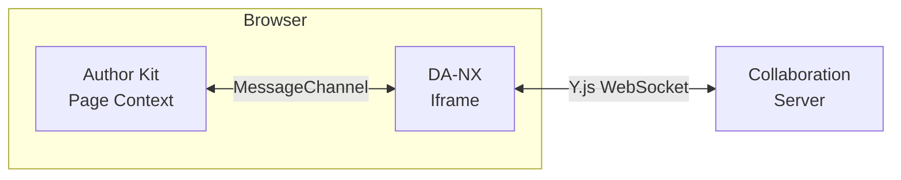
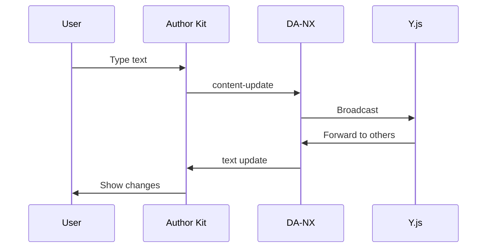
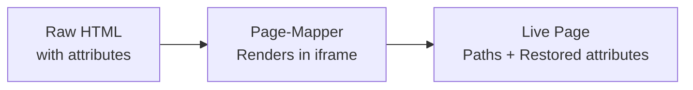
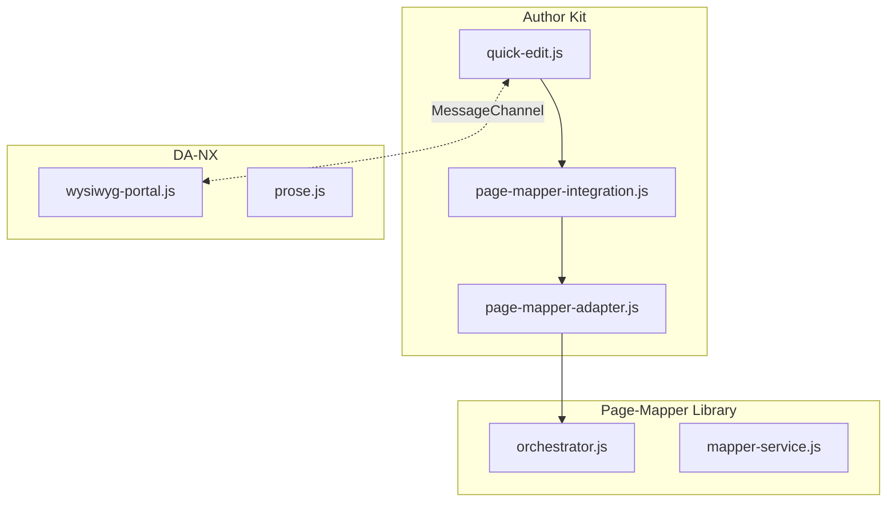

# Quick Edit Tool

Real-time collaborative WYSIWYG editing for Author Kit. Enables direct in-page content editing with live synchronization across users.

## Overview

Quick Edit bridges two projects:

- **Author Kit** (page integration) - Runs on the actual web page, captures user interactions
- **DA-NX** (editor) - Runs in an iframe, provides ProseMirror editor with Y.js collaboration

## Key Features

- 🔄 Real-time bidirectional synchronization
- 👥 Multi-user collaborative editing
- 📍 Robust element mapping (survives DOM transformations)
- 🎯 Automatic attribute restoration
- 🔌 Secure cross-frame communication

## How It Works

### Page-Mapper Integration

**Problem**: Attributes set on raw HTML are lost during page rendering (block initialization, DOM transforms).

**Solution**: Page-mapper creates structural path mappings that survive transformations.

## Quick Start

### Data Attributes

| Attribute | Purpose | Example |
|-----------|---------|---------|
| `data-cursor` | ProseMirror position | `"42"` |
| `data-path-to-source` | Structural path (base64) | `"W3sidGFnI..."` |
| `contenteditable` | Makes element editable | `"true"` |

### Message Types

**Page → Editor**:
- `content-update` - User typed text
- `cursor-move` - User clicked/navigated
- `reload` - Request full refresh

**Editor → Page**:
- `set: 'body'` - Full HTML update (structural changes)
- `set: 'text'` - Optimized text-only update
- `set: 'cursors'` - Remote cursor positions

## Architecture

### Project Structure

