# Quick Edit - Technical Documentation

This document provides detailed technical information about the Quick Edit implementation, including API references, sequence diagrams, debugging guides, and troubleshooting.

## Table of Contents

- [Initialization Flow](#initialization-flow)
- [Component API Reference](#component-api-reference)
- [Page-Mapper Integration Details](#page-mapper-integration-details)
- [Message Protocol Specification](#message-protocol-specification)
- [Data Attributes Lifecycle](#data-attributes-lifecycle)
- [Sequence Diagrams](#sequence-diagrams)

---

## Initialization Flow

### Complete Initialization Sequence

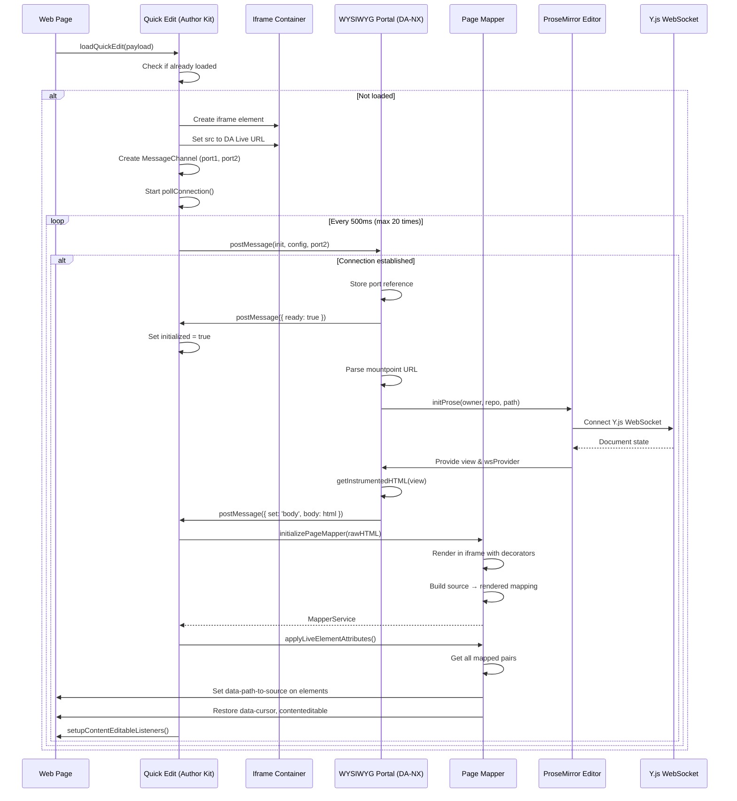

### Component Initialization Dependencies

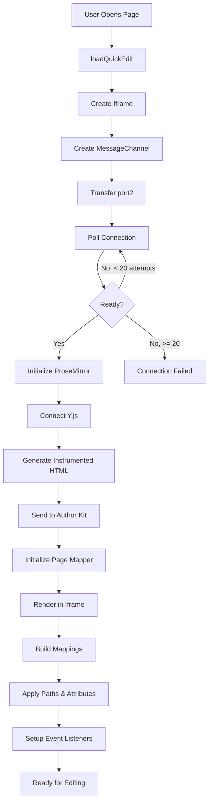

---

## Component API Reference

### Author Kit Component Hierarchy

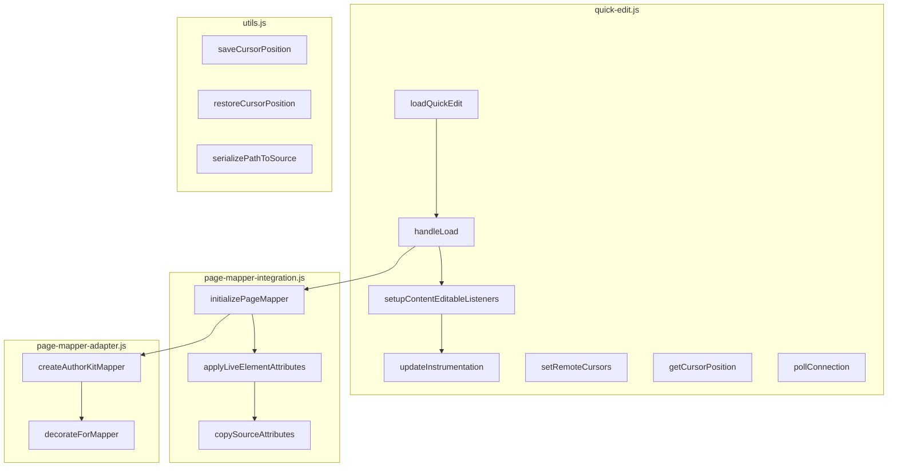

### DA-NX Component Hierarchy

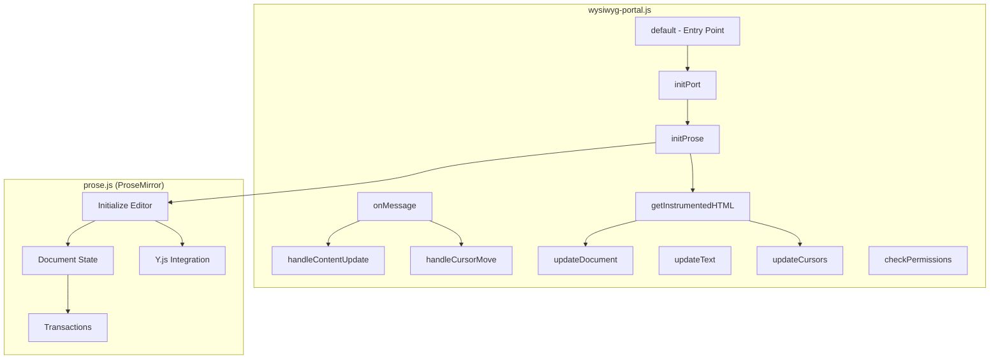

### Function Parameters & Returns

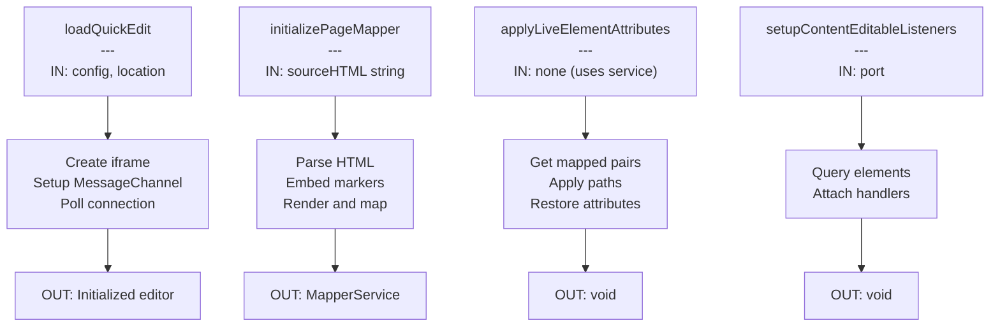

---

## Page-Mapper Integration Details

### Problem & Solution

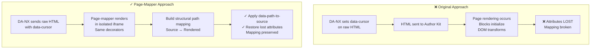

### Three-Phase Mapping Process

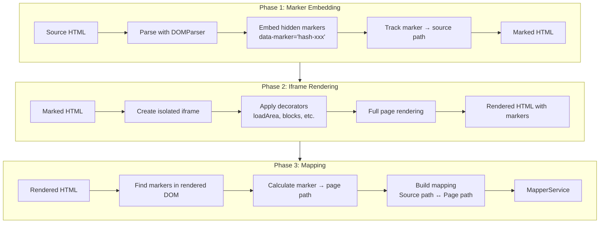

### Path Calculation Example

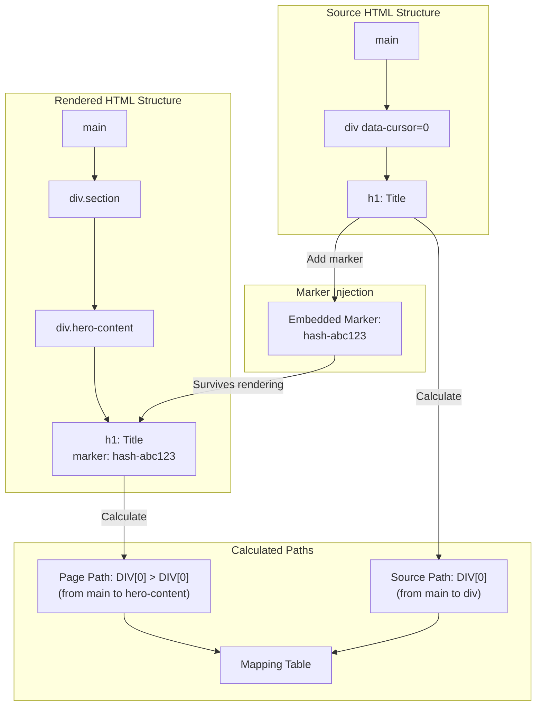

### Attribute Restoration Flow

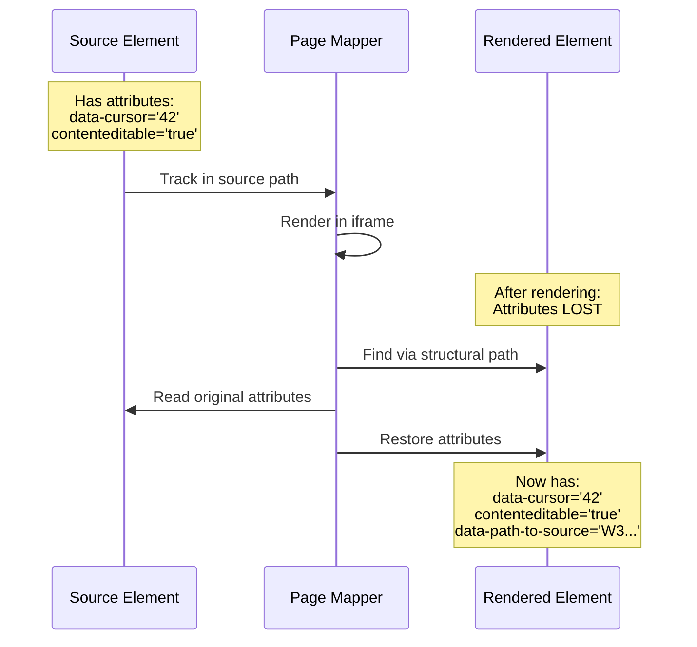

### Configured Attributes

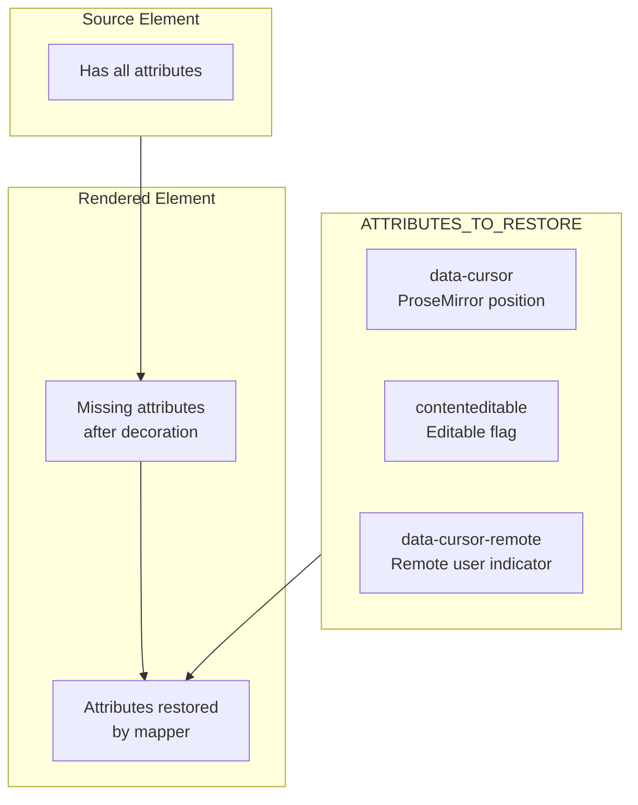

---

## Message Protocol Specification

### Message Flow Overview

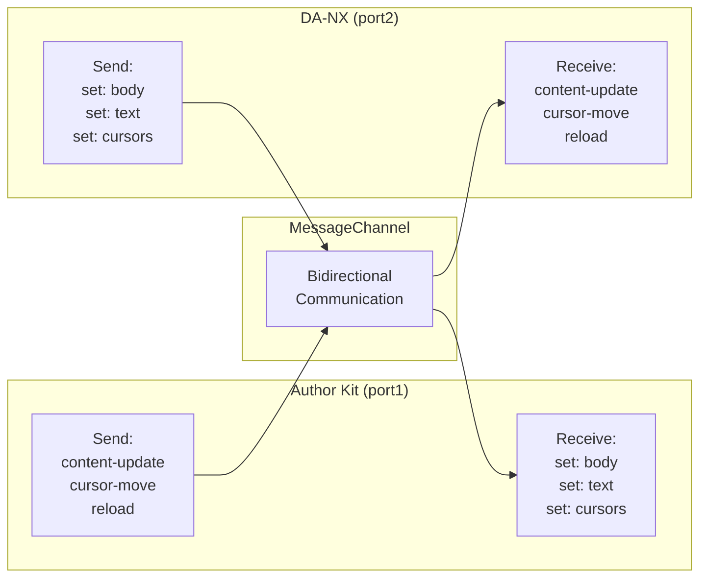

### Author Kit → DA-NX Messages

```mermaid
flowchart TD
    subgraph ContentUpdate["content-update"]
        CU_TRIG[Trigger:<br/>User types in element]
        CU_DATA["Data:<br/>- type: 'content-update'<br/>- newText: string<br/>- cursorOffset: number<br/>- pathToSource: string"]
        CU_HAND[Handler:<br/>handleContentUpdate]
        CU_ACT[Action:<br/>Update ProseMirror doc<br/>Broadcast via Y.js]
        
        CU_TRIG --> CU_DATA
        CU_DATA --> CU_HAND
        CU_HAND --> CU_ACT
    end
    
    subgraph CursorMove["cursor-move"]
        CM_TRIG[Trigger:<br/>User clicks/navigates]
        CM_DATA["Data:<br/>- type: 'cursor-move'<br/>- cursorOffset: number<br/>- textCursorOffset: number<br/>- pathToSource: string"]
        CM_HAND[Handler:<br/>handleCursorMove]
        CM_ACT[Action:<br/>Update selection<br/>Broadcast cursor position]
        
        CM_TRIG --> CM_DATA
        CM_DATA --> CM_HAND
        CM_HAND --> CM_ACT
    end
    
    subgraph Reload["reload"]
        R_TRIG[Trigger:<br/>Element not found]
        R_DATA["Data:<br/>- type: 'reload'"]
        R_HAND[Handler:<br/>onMessage]
        R_ACT[Action:<br/>Send full document]
        
        R_TRIG --> R_DATA
        R_DATA --> R_HAND
        R_HAND --> R_ACT
    end
```

### DA-NX → Author Kit Messages

```mermaid
flowchart TD
    subgraph SetBody["set: 'body'"]
        SB_TRIG[Trigger:<br/>Structural changes<br/>Initialization]
        SB_DATA["Data:<br/>- set: 'body'<br/>- body: HTML string"]
        SB_HAND[Handler:<br/>port1.onmessage]
        SB_ACT[Action:<br/>Replace body.innerHTML<br/>Run page-mapper<br/>Setup listeners]
        
        SB_TRIG --> SB_DATA
        SB_DATA --> SB_HAND
        SB_HAND --> SB_ACT
    end
    
    subgraph SetText["set: 'text'"]
        ST_TRIG[Trigger:<br/>Text-only changes]
        ST_DATA["Data:<br/>- set: 'text'<br/>- text: string<br/>- cursorOffset: number"]
        ST_HAND[Handler:<br/>port1.onmessage]
        ST_ACT[Action:<br/>Update element.textContent<br/>Save/restore cursor<br/>Update instrumentation]
        
        ST_TRIG --> ST_DATA
        ST_DATA --> ST_HAND
        ST_HAND --> ST_ACT
    end
    
    subgraph SetCursors["set: 'cursors'"]
        SC_TRIG[Trigger:<br/>Remote cursor move]
        SC_DATA["Data:<br/>- set: 'cursors'<br/>- body: HTML with cursors"]
        SC_HAND[Handler:<br/>port1.onmessage]
        SC_ACT[Action:<br/>Update data-cursor-remote<br/>Show visual indicators]
        
        SC_TRIG --> SC_DATA
        SC_DATA --> SC_HAND
        SC_HAND --> SC_ACT
    end
```

### Message Routing in DA-NX

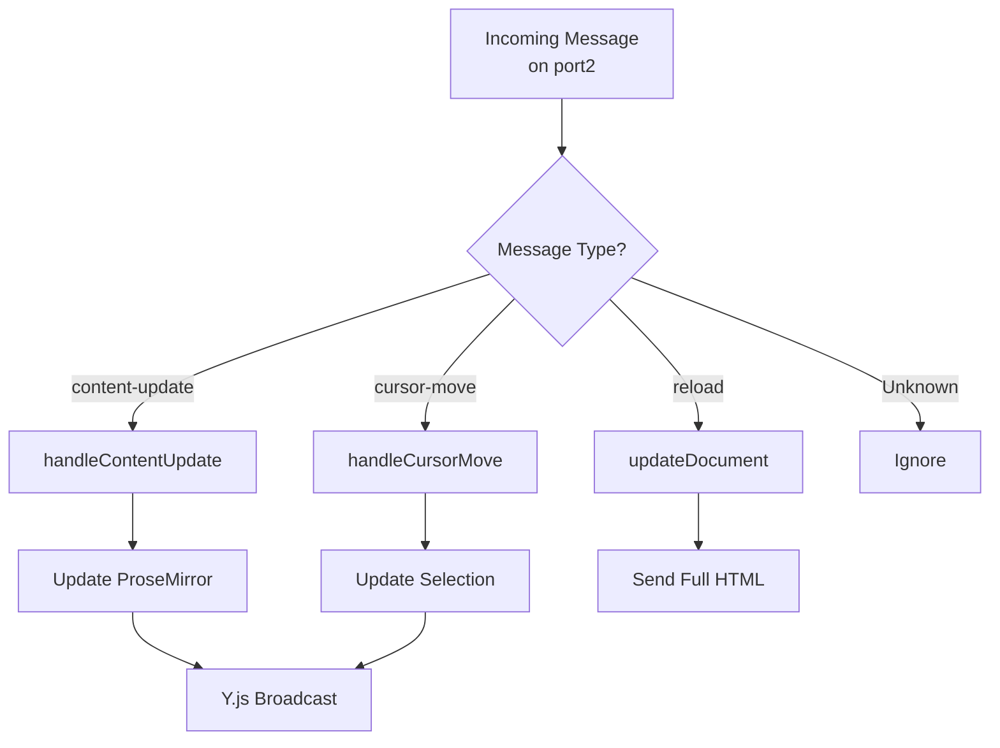

---

## Data Attributes Lifecycle

### Attribute Flow Diagram

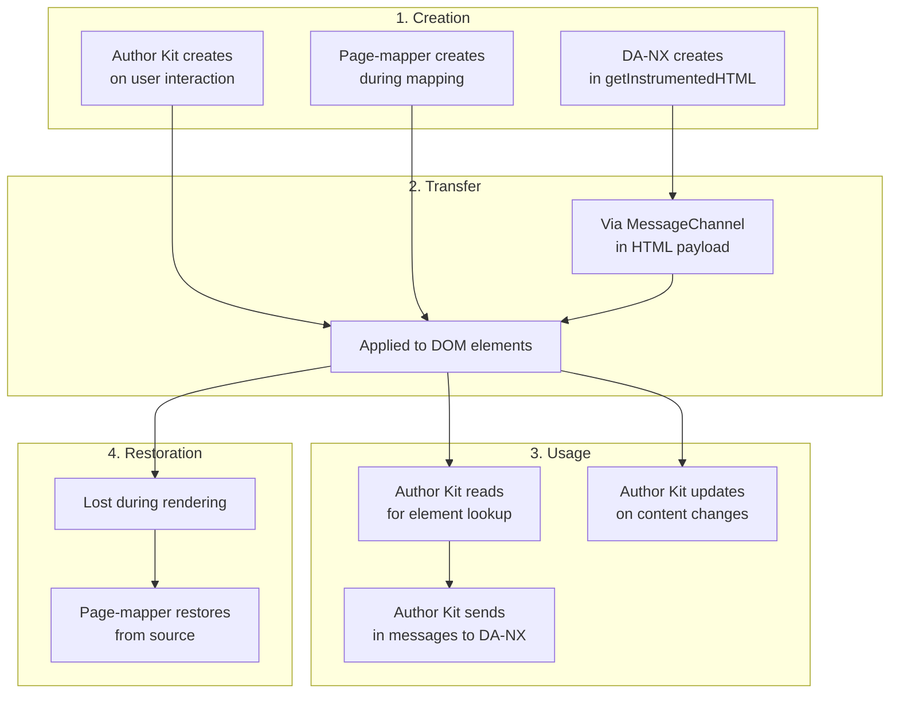

### data-cursor Lifecycle

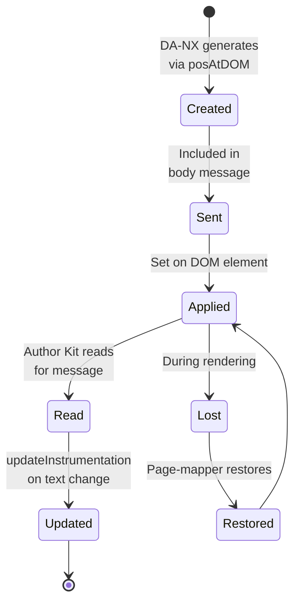

### data-path-to-source Lifecycle

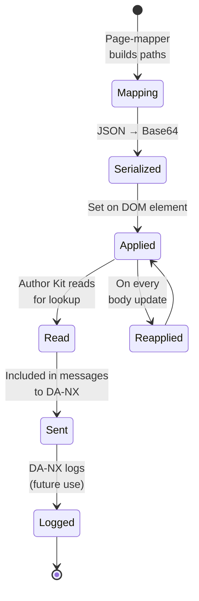

### Attribute Dependencies

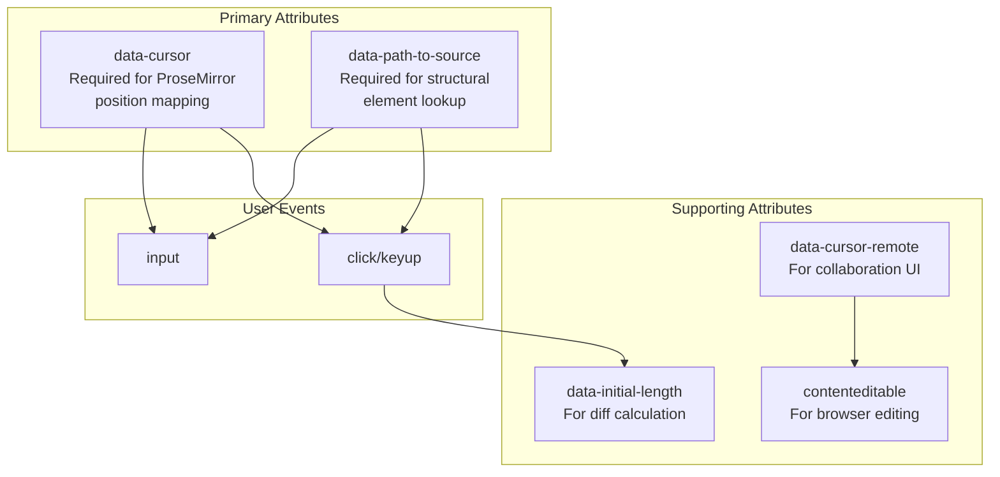

---

## Sequence Diagrams

### Complete Editing Session

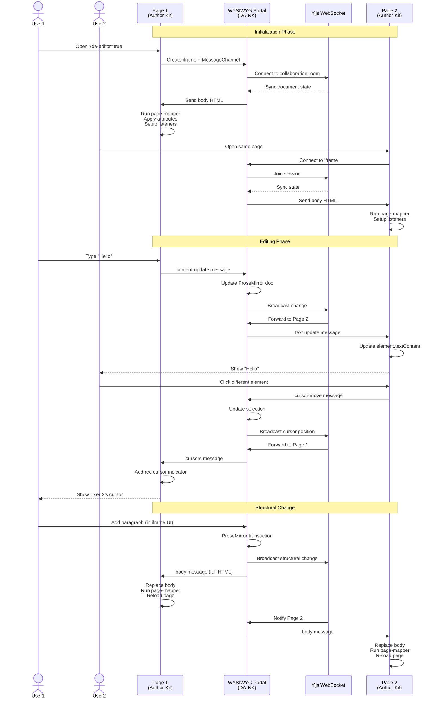

### Error Handling Flow

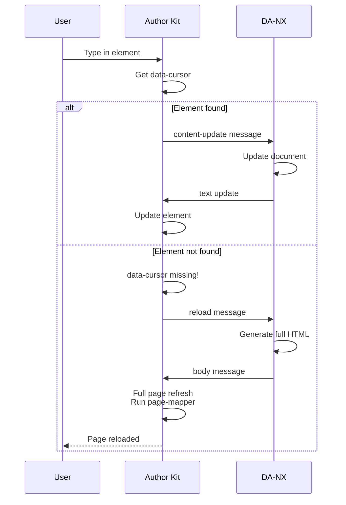

### Cursor Position Synchronization

```mermaid
sequenceDiagram
    participant User
    participant Element as Editable Element
    participant QE as Quick Edit
    participant WP as WYSIWYG Portal
    participant PM as ProseMirror
    
    User->>Element: Click at position
    Element->>QE: click event
    QE->>QE: getCursorPosition()<br/>Get data-cursor<br/>Get pathToSource
    QE->>WP: cursor-move message
    WP->>PM: Calculate absolute position<br/>(cursorOffset + textCursorOffset)
    PM->>PM: Validate position
    
    alt Position valid
        PM->>PM: Create selection transaction
        PM->>PM: Dispatch transaction
        PM->>PM: Broadcast via Y.js awareness
    else Position invalid
        WP->>WP: Log warning<br/>Ignore invalid position
    end
```
